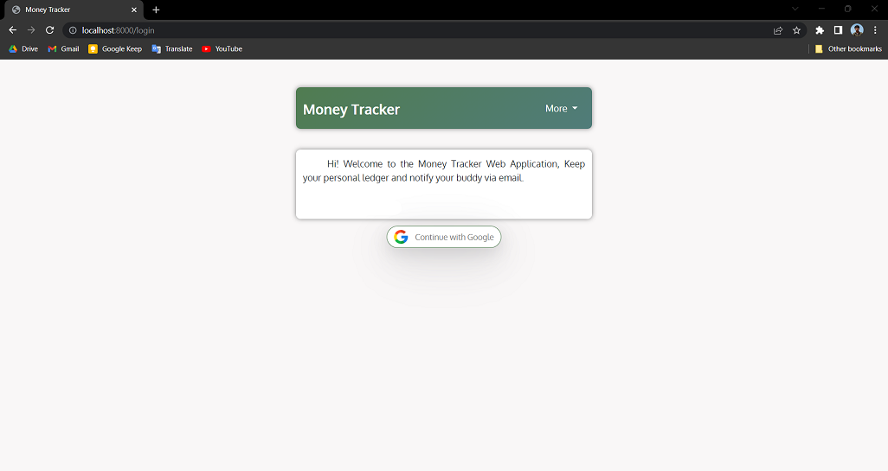
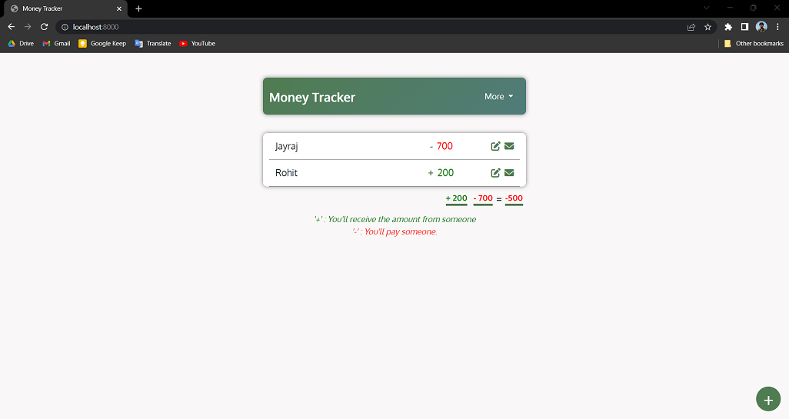
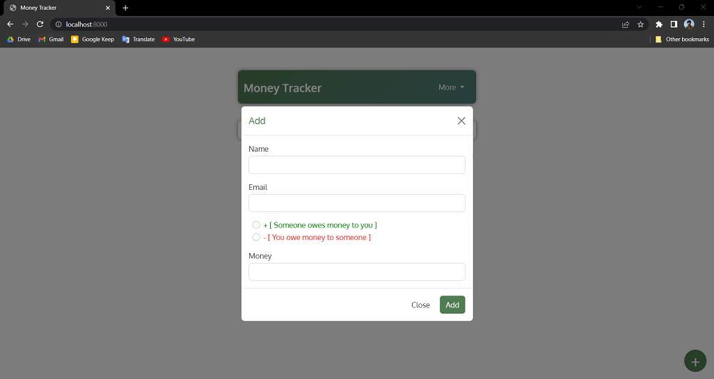
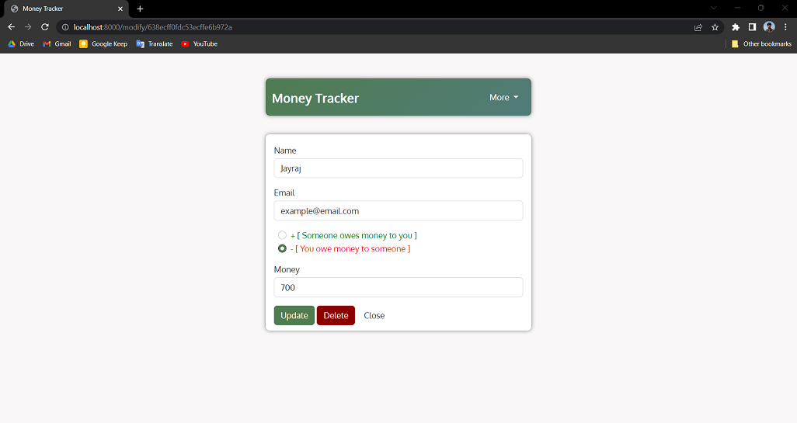
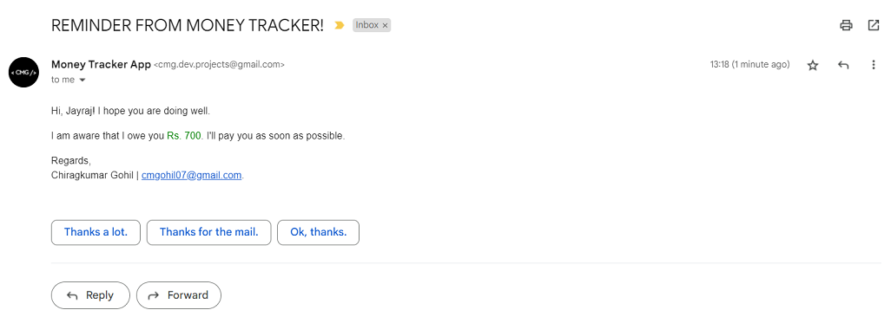
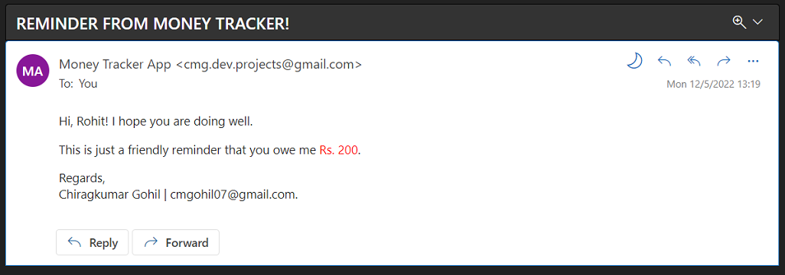

# Money Tracker Project

This web application allows one to keep track on one's personal ledger. One can save the data of whether he owes money to someone or if someone owes money to him. Also, one can send a reminder to a person via email.

## Features

- Create an account using Google
- Create a ledger with name, email, amount to be paid or recieved
- Modify the name, amount or email
- Delete the data from the list
- Remind your colleagues with an email

## Link to the Website

- [Highlighs - Youtube](https://youtu.be/VbyT3UU0gOQ)

## Tech

- **Client** : EJS, Bootstrap
- **Server** : Node, Express, Mongoose, Passport, Nodemailer
- **Database** : MongoDB

## Screenshots








## Installation

- Clone the Repository
- Use below commands:
	1. ```npm install```
	2. ```npm run start```

### Environment Variables

```MONGO_URL```
```CLIENT_ID```
```CLIENT_SECRET```
```REDIRECT_URI```
```MY_SECRET```
```SESSION_SECRET```

## Useful Links

- https://console.cloud.google.com/apis/dashboard
- https://developers.google.com/oauthplayground/
- https://www.passportjs.org/packages/passport-google-oauth20/
- https://www.npmjs.com/package/cookie-session
- https://nodemailer.com/smtp/oauth2/
